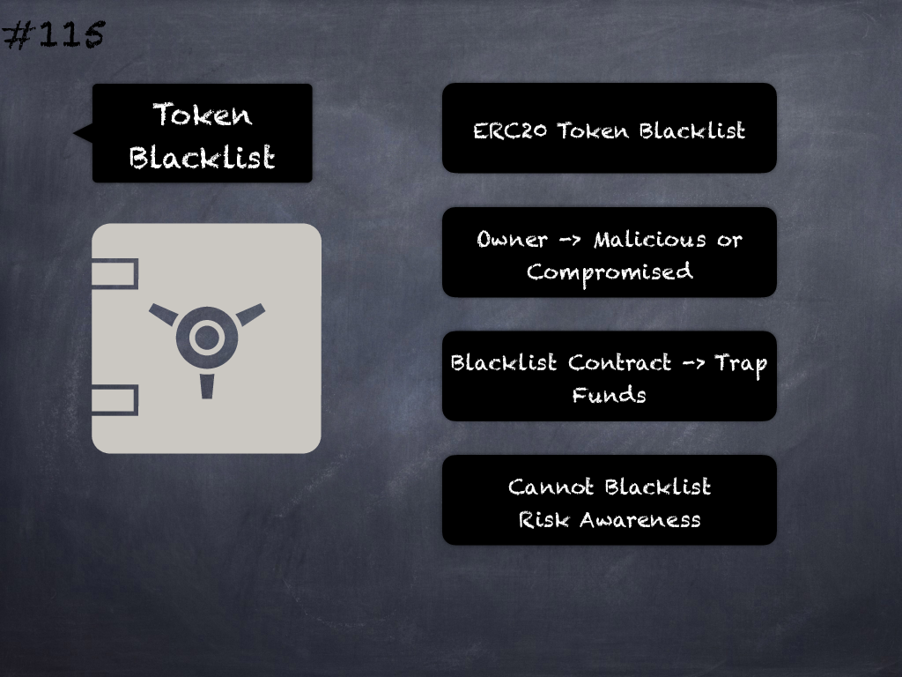

# 115 - [Token owner cannot blacklist the contract](Token%20owner%20cannot%20blacklist%20the%20contract.md)
Malicious or compromised owners can trap contracts relying on tokens with a blacklist. (See [here](https://github.com/crytic/building-secure-contracts/blob/master/development-guidelines/token_integration.md#owner-privileges))
___
## Slide Screenshot

___
## Slide Text
- 
___
## References
- Youtube Reference
___
## Tags