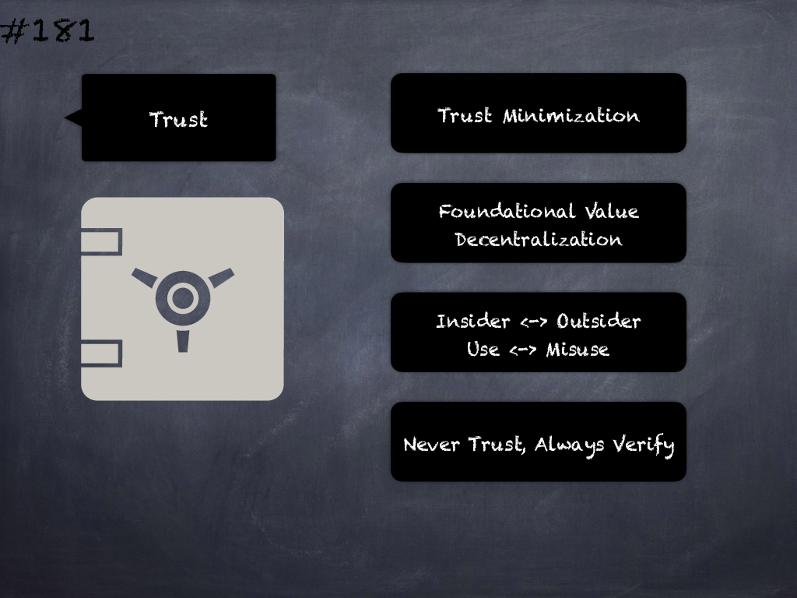

# 181 - [Trust issues](Trust%20issues.md)
Incorrect or Insufficient trust assumption about/among system actors and external entities will lead to privilege escalation/abuse which may lead to security issues.
___
## Slide Screenshot

___
## Slide Text
- 
___
## References
- Youtube Reference
___
## Tags