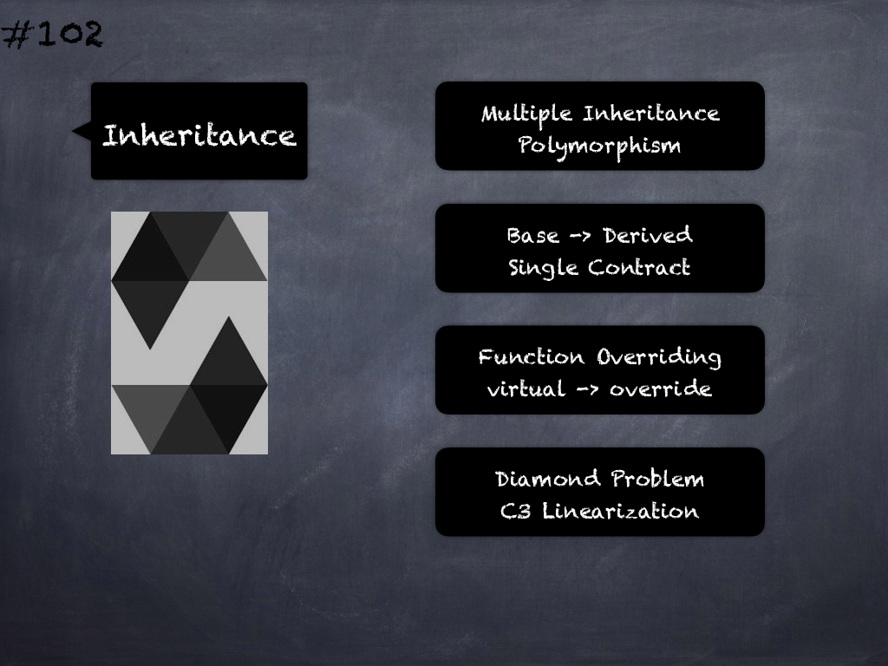

# 102 - [Inheritance](Inheritance.md)
Solidity supports multiple inheritance including polymorphism:

1. Polymorphism means that a [function](../2.%20Solidity%20101/Functions.md) call (internal and external) always executes the function of the same name (and parameter types) in the most derived contract in the inheritance hierarchy
    
2. When a contract inherits from other contracts, only a single contract is created on the blockchain, and the code from all the base contracts is compiled into the created contract.
    
3. Function Overriding: Base functions can be overridden by inheriting contracts to change their behavior if they are marked as `virtual`. The overriding function must then use the `override` keyword in the function header. 
    
4. Languages that allow multiple inheritance have to deal with several problems. One is the Diamond Problem. Solidity is similar to Python in that it uses “C3 Linearization” to force a specific order in the directed acyclic graph (DAG) of base classes. So when a function is called that is defined multiple times in different contracts, the given bases are searched from right to left (left to right in Python) in a depth-first manner, stopping at the first match.

___
## Slide Screenshot

___
## Slide Text
- Multiple Inheritance
- Polymorphism
- Base -> Derived
- Single Contract
- Function Overriding
- virtual -> override
- Diamon Problem
- C3 Linearization
___
## References
- [Youtube Reference](https://youtu.be/3bFgsmsQXrE?t=92)
___
## Tags