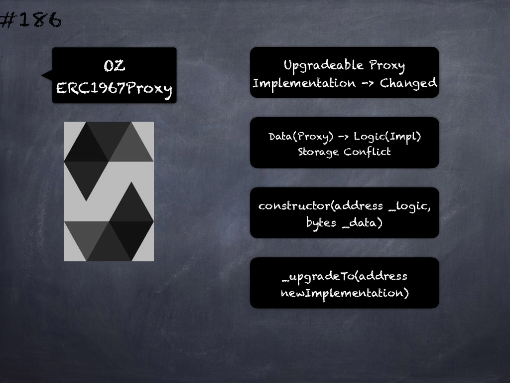

# 186 - [OZ ERC1967Proxy](OZ%20ERC1967Proxy.md)
OpenZeppelin ERC1967Proxy: implements an upgradeable proxy. It is upgradeable because calls are delegated to an implementation address that can be changed. This address is stored in storage in the location specified by EIP1967, so that it doesn’t conflict with the storage layout of the implementation behind the proxy. Upgradeability is only provided internally through `_upgradeTo`.

1.  `_constructor(address _logic, bytes _data)`: Initializes the upgradeable proxy with an initial implementation specified by `_logic`. If `_data` is nonempty, it’s used as data in a delegate call to `_logic`. This will typically be an encoded function call, and allows initializing the storage of the proxy like a Solidity constructor.
    
2.  `_implementation()` → `address impl`: Returns the current implementation address.
    
3.  `_upgradeTo(address newImplementation)`: Upgrades the proxy to a new implementation. Emits an Upgraded event.
___
## Slide Screenshot

___
## Slide Text
- Upgradeable Proxy 
- Implementation -> Changed
- Data(Proxy) -> Logic(Impl)
- Storage Conflict
- `constructor(address _logic, bytes _data)`
- `_upgradeTo(address newImplementation)`
___
## References
- [Youtube Reference](https://youtu.be/0kx8M4u5980?t=485)
___
## Tags