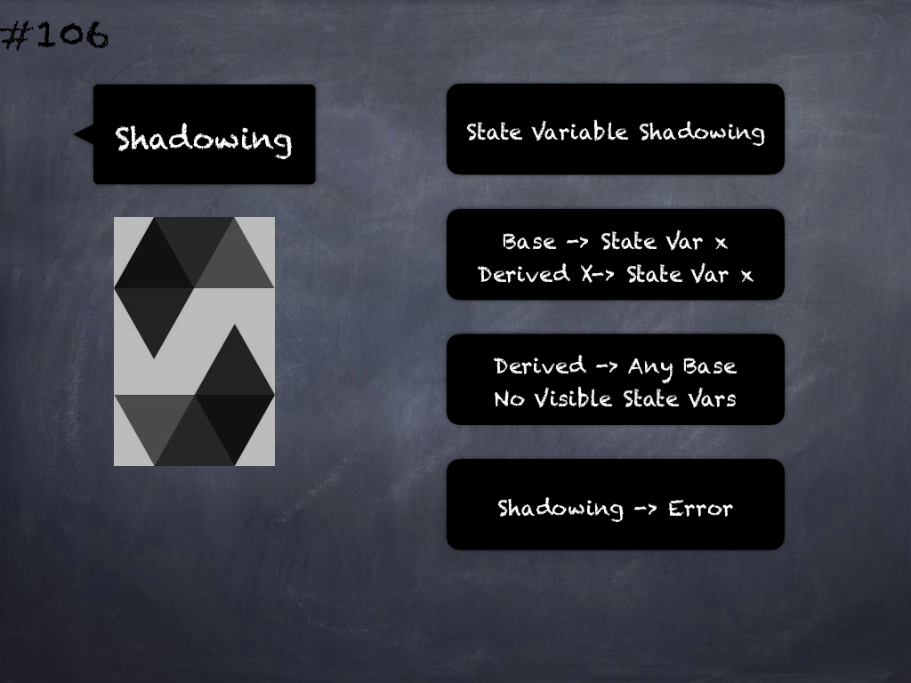

# 147 - [OZ Libraries](OZ%20Libraries.md)
OpenZeppelin’s smart contract libraries are perhaps the most commonly used libraries in smart contract projects. 

These include contracts for popular token standards, access control, security, safe math, proxies and other utilities.

___
## Slide Screenshot

___
## Slide Text
- OpenZeppelin Smart Contract Libraries
- Widely Used
- Time-tested & Optimized
- SafeMath Library
- Token Standards, Security, Proxy, Utils
___
## References
- [Youtube Reference](https://youtu.be/C0zBhTgppLQ?t=877)
___
## Tags