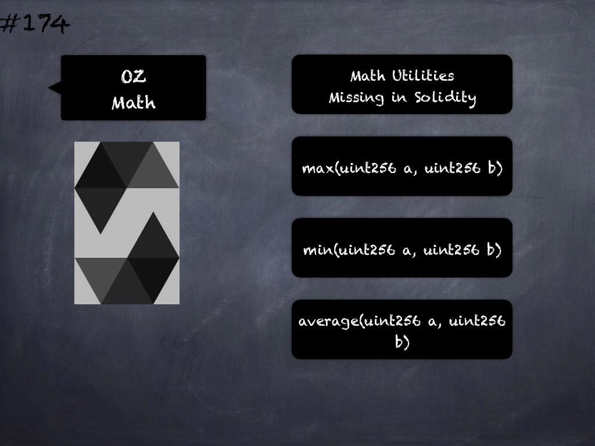

# 174 - [OZ Math](OZ%20Math.md)
OpenZeppelin Math: Standard math utilities missing in the Solidity language:

1.  `max(uint256 a, uint256 b)`: Returns the larger of two numbers
    
2.  `min(uint256 a, uint256 b)`: Returns the smaller of two numbers
    
3.  `average(uint256 a, uint256 b)`: Returns the average of two numbers. The result is rounded towards zero.
___
## Slide Screenshot

___
## Slide Text
- Math Utilities Missing in Solidity
- `max(uint256 a, uint256 b)`
- `min(uint256 a, uint256 b)`
- `average(uint256 a, uint256 b)`
___
## References
- [Youtube Reference](https://youtu.be/L_9Fk6HRwpU?t=829)
___
## Tags