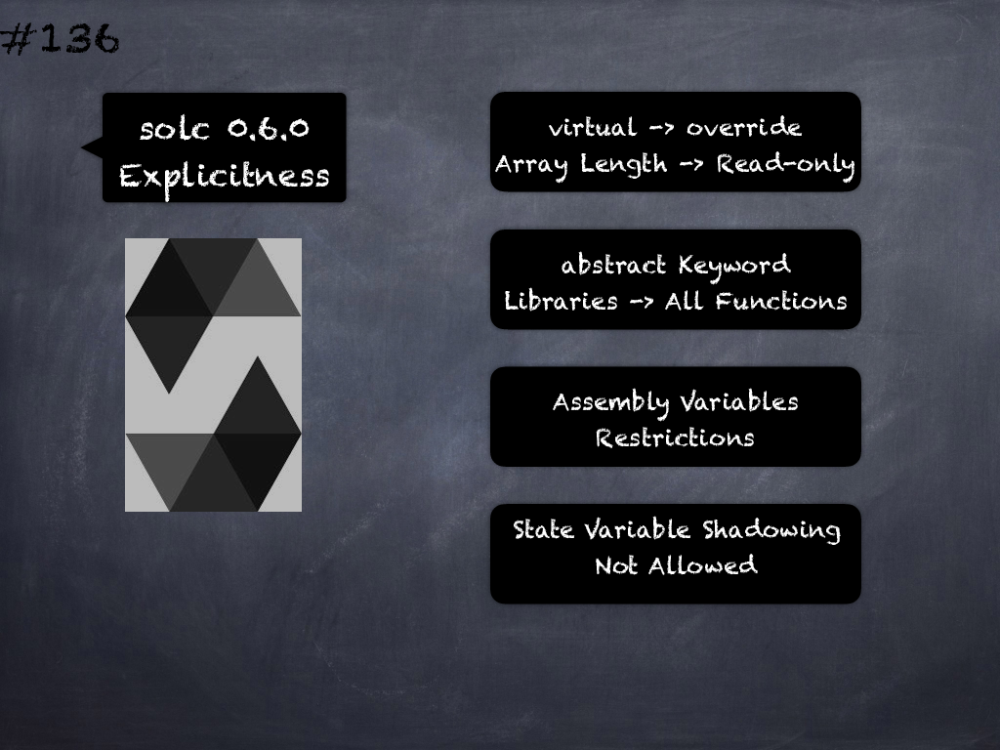

# 131 - [Reserved Keywords](Reserved%20Keywords.md)
These keywords are reserved in Solidity. They might become part of the syntax in the future: `after`, `alias`, `apply`, `auto`, `case`, `copyof`, `default`, `define`, `final`, `immutable`, `implements`, `in`, `inline`, `let`, `macro`, `match`, `mutable`, `null`, `of`, `partial`, `promise`, `reference`, `relocatable`, `sealed`, `sizeof`, `static`, `supports`, `switch`, `typedef`, `typeof`, `unchecked`

___
## Slide Screenshot

___
## Slide Text
- Keywords -> Reserved for Future
- Current Syntax -> No
- Future Syntax -> Maybe
- E.g.: after, `alias`, `apply`, `auto`, `case`, `null`, etc
- E.g.: `unchecked` in v0.8.0
___
## References
- [Youtube Reference](https://youtu.be/TqMIbouwePE?t=934)
___
## Tags