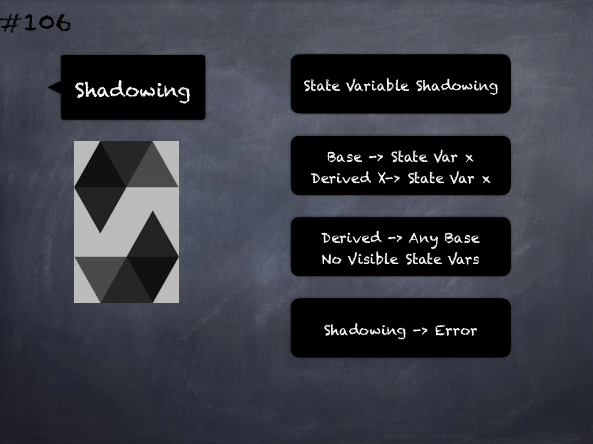

# 106 - [Shadowing](Shadowing.md)
This is considered as an error. 

A derived contract can only declare a state variable x, if there is no visible state variable with the same name in any of its bases.

___
## Slide Screenshot

___
## Slide Text
- State Variable Shadowing
- Base -> State Var x
- Derived X -> State Var x
- Derived -> Any Base
	- No Visible State Vars
- Shadowing -> Error
___
## References
- [Youtube Reference](https://youtu.be/3bFgsmsQXrE?t=496)
___
## Tags