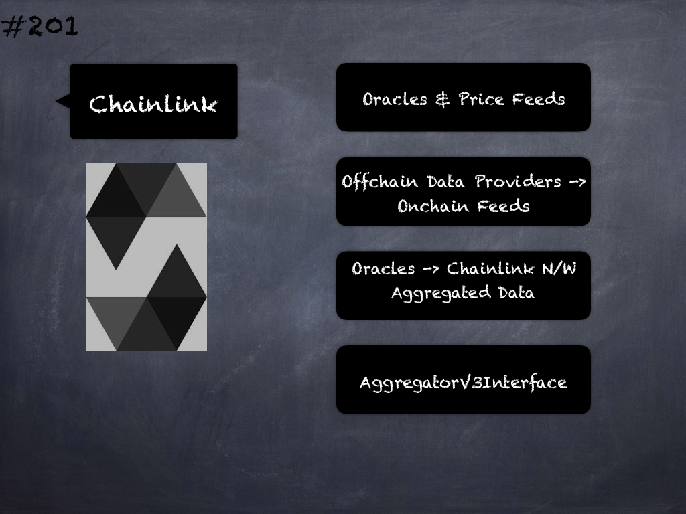

# 104 - [Using for](Using%20for.md)
The directive `using A for B`; can be used to attach library functions (from the `library A`) to any type (`B`) in the context of a contract. These functions will receive the object they are called on as their first parameter.

1. The `using A for B`; directive is active only within the current contract, including within all of its functions, and has no effect outside of the contract in which it is used. 
    
2. The directive may only be used inside a contract, not inside any of its functions.

___
## Slide Screenshot

___
## Slide Text
- Directive using A for B
- Attach Functions
- Library A -> Type B
- Object -> First Parameter
	- Only Inside Contract
- E.g.: using SafeMath for uint256;
___
## References
- [Youtube Reference](https://youtu.be/3bFgsmsQXrE?t=353)
___
## Tags