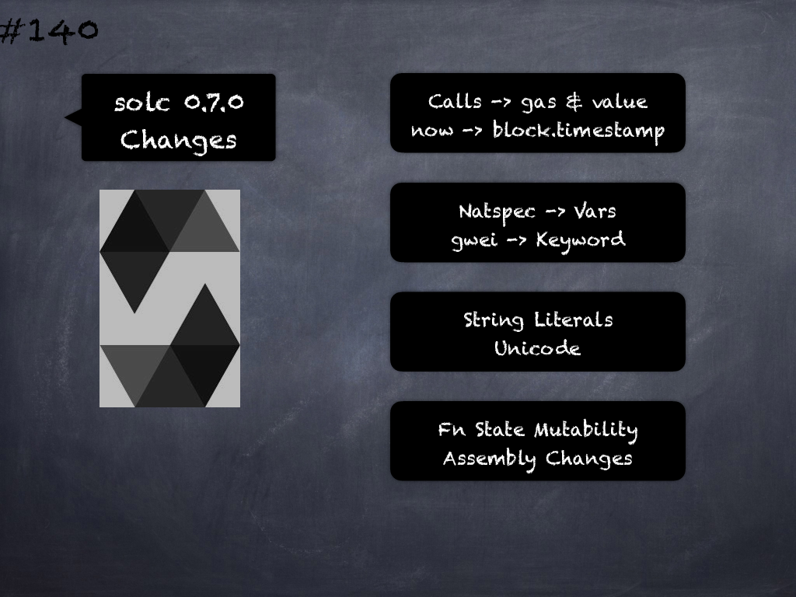

# 140 - [solc 0.7.0 Changes](solc%200.7.0%20Changes.md)
Solidity v0.7.0 Changes to the Syntax - changes that might cause existing contracts to not compile anymore:

1.  In external function and contract creation calls, Ether and gas is now specified using a new syntax: `x.f{gas: 10000, value: 2 ether}(arg1, arg2)`. The old syntax – `x.f.gas(10000).value(2 ether)(arg1, arg2)` – will cause an error.
    
2.  The global variable `now` is deprecated, `block.timestamp` should be used instead. The single identifier `now` is too generic for a global variable and could give the impression that it changes during transaction processing, whereas `block.timestamp` correctly reflects the fact that it is just a property of the block.
    
3.  NatSpec comments on variables are only allowed for public state variables and not for local or internal variables
    
4.  The token `gwei` is a keyword now (used to specify, e.g. `2 gwei` as a number) and cannot be used as an identifier
    
5.  String literals now can only contain printable ASCII characters and this also includes a variety of escape sequences, such as hexadecimal (`\xff`) and unicode escapes (`\u20ac`).

    
6.  Unicode string literals are supported now to accommodate valid UTF-8 sequences. They are identified with the unicode prefix: unicode"Hello 😃".
    
7.  State Mutability: The state mutability of functions can now be restricted during inheritance. Functions with default state mutability can be overridden by `pure` and `view` functions while `view` functions can be overridden by `pure` functions. At the same time, public state variables are considered `view` and even `pure` if they are constants.
    
	1.  Disallow `.` in user-defined function and variable names in inline assembly. It is still valid if you use Solidity in Yul-only mode.
    
9.  Slot and offset of storage pointer variable x are accessed via `x.slot` and `x.offset` instead of x_slot and x_offset.

___
## Slide Screenshot

___
## Slide Text
- Calls -> gas & value
- now -> block.timestamp
- Natspec -> Vars
- gwei -> Keyword
- String Literals
- Unicode
- Fn State Mutability
- Assembly Changes
___
## References
- [Youtube Reference](https://youtu.be/TqMIbouwePE?t=1987)
___
## Tags